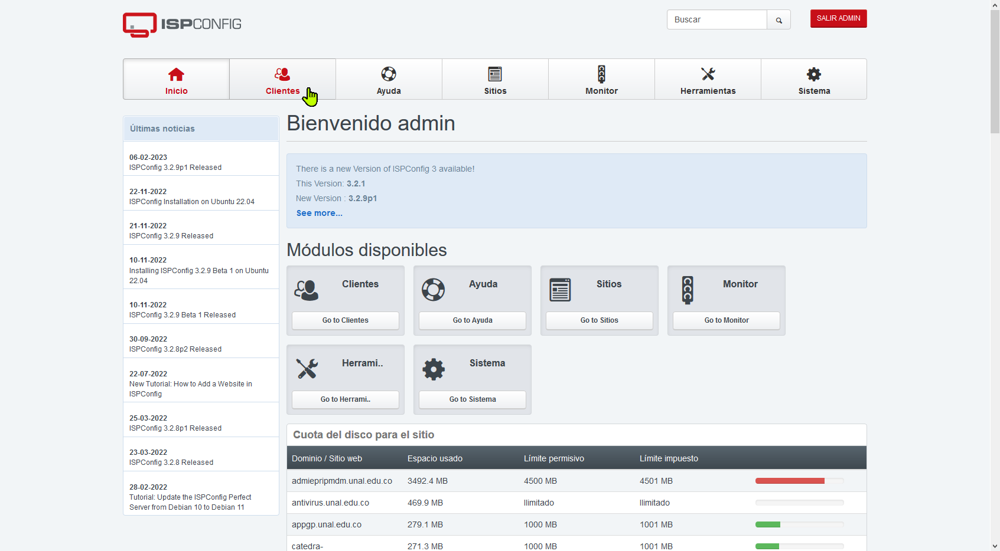
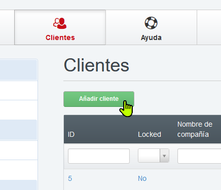
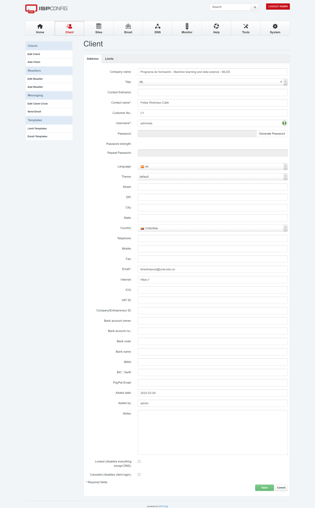
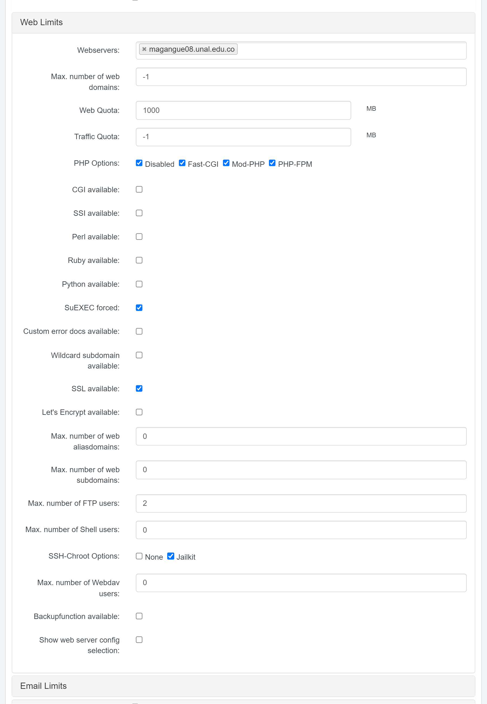
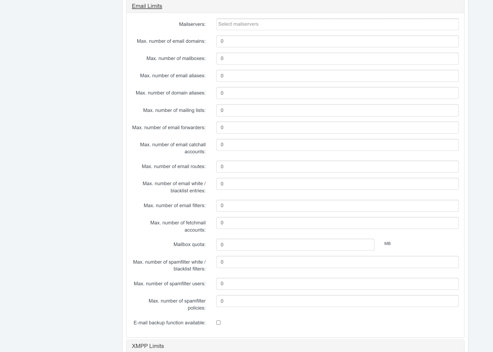
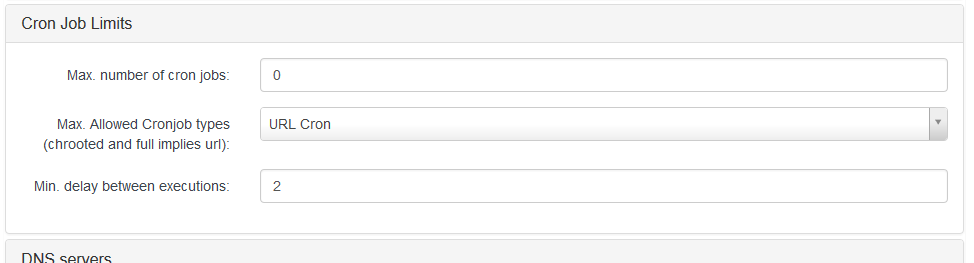
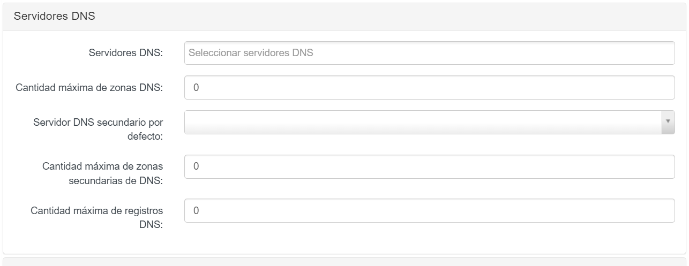
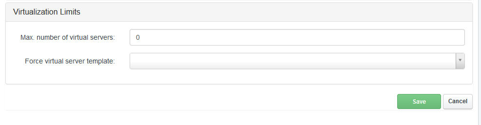
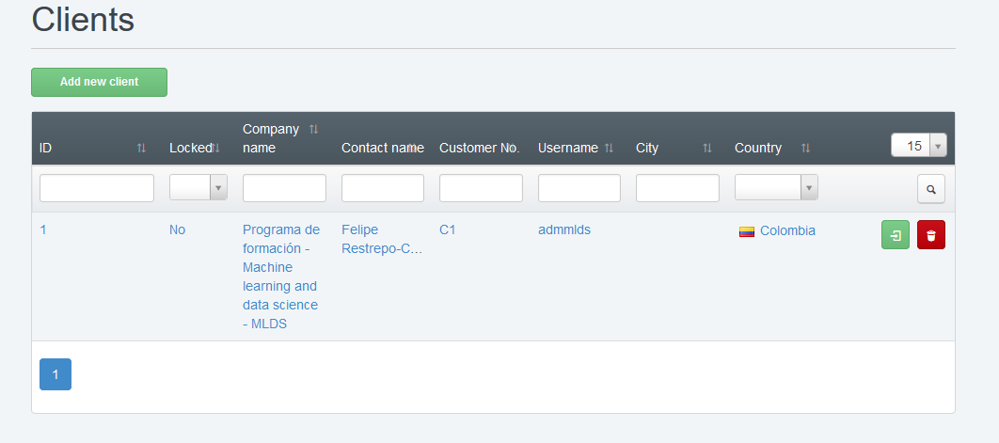

# Crear cliente en ispconfig

Para crear un cliente nos dirigimos al ispconfig e ingresamos con el usuario y contraseña de dministrador, una ves alli veremos la pantalla principal, donde nos dirigiremos a la opción de clientes.

Una vez en este apartado daremos clic en *Añadir cliente*

Se abre un formulario donde rellenaremos los datos de:

- Nombre de la copañia: en general se usa el nombre enviado en la solicitud
- titulo:
- Nombre del contacto
- Cliente N° que se asigna automatico
- nombre del usuario que seusa una convencion tipo adm+nombre abrebiado del nombre usado en nombre de compañia
- Contraseña, que se genera y se debe copiar porque no se puede ver este parametro despues
- idioma
- pais
- correo: que es el correo del administrador del sitio el cual es el correo que viene enla solicitud

ahora nos dirigimos a la pestaña de limites

## web limits

En el apartado de web limits seleccionamos

- Max. number of web domains 1
-  Web Quota 1000 MB
 - PHP
	 - [ ] Disabled  
	 - [x] Fast-CGI
	 - [x] Mod-PHP
	 - [x] PHP-FPM
- SuEXEC forced
- SSL available
- Max. number of web aliasdomains lo ponemos en 0
- Max. number of web subdomains lo ponemos en 0
- Max. number of FTP users lo dejamos en 2
- Max. number of Shell users lo ponemos en 0
- SSH-Chroot Options
	- [ ] None
	- [x] Jailkit
- Backupfunction available: lo dejamos desmarcado si no queremos que el cliente pueda hacer backups, encaso de lo contrario lo marcamos.s 

## email limits
En la siguiente sección como no vamos a usar email  vamos a dejar todos los campos en ceros, y eliminamos el servidor de correo.

## XMPP Limits 

Tambien dejamos todo en ceros y sin marcar

## Database limits

Modificamos para permitir solo una base de datos con un usuario y 100 MB de espacio en base de datos

## Cron Job Limits
Modificamos para que el máximo de trabajos cron sean 2

## DNS servers 

Aquí eliminamos el servidor de DNS Server y dejamos todo en 0

## Virtualization Limits 

Lo dejamos como aparece

Una ves terminado damos a guardar y veremos como ya tenemos un cliente con la información que agregamos

ahora solo nos queda crear el sitio en [02_crear_sitio_en_ispconfig](02_crear_sitio_en_ispconfig.md)

