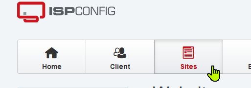
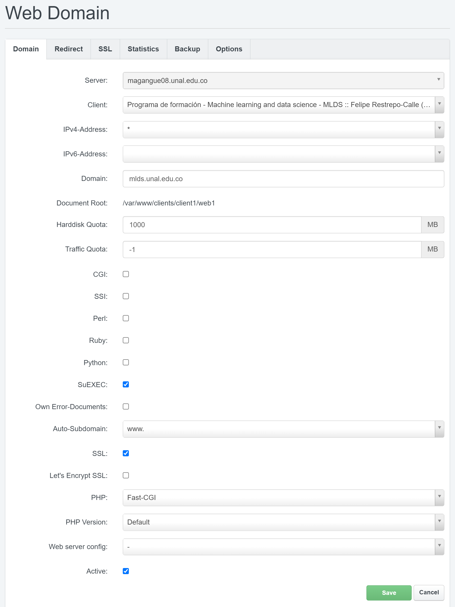
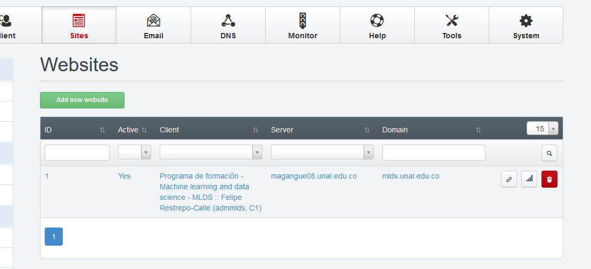

# Crar sitio en ispconfig
Una ves creamos el cliente que vimos en [Crear_cliente_en_ispconfig](Crear_cliente_en_ispconfig.md) vamos a crear un sitio para el cliente, para esonos dirijios a la pestaña de *Sites*.

damos en el boton de *Add new webside*. se nos abre un nueo formulario con multiples pestañas

## Domain
aquí seleccionamos el cliente al cual va a pertenecer el sitio, en dominio ponemos el dominio que tendra el sitio, agregamos el espacio en disco de 1000 MB, desabilitamos *Own Error-Documents*, abilitamos *SSL*, en *PHP* seleccionamos Fast-CGI.

El resto de pestañas quedan todas por defecto, al guardar veremos el nuevo sitio creado

Ahora para permitir al usuario subir sus archivos al hosting debemos crear un usuario para FTP. en [03_crear_usuario_ftp_en_ispconfig](03_crear_usuario_ftp_en_ispconfig.md)

