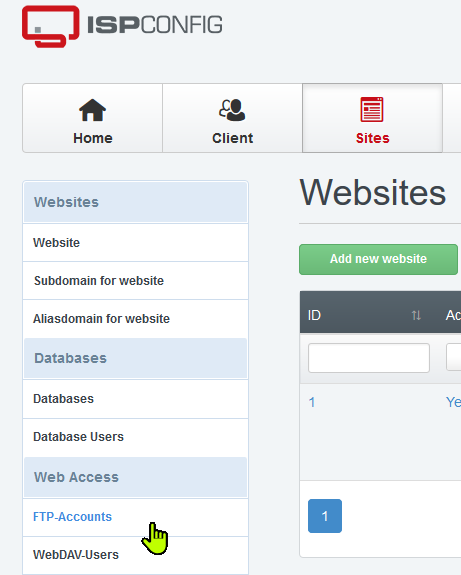
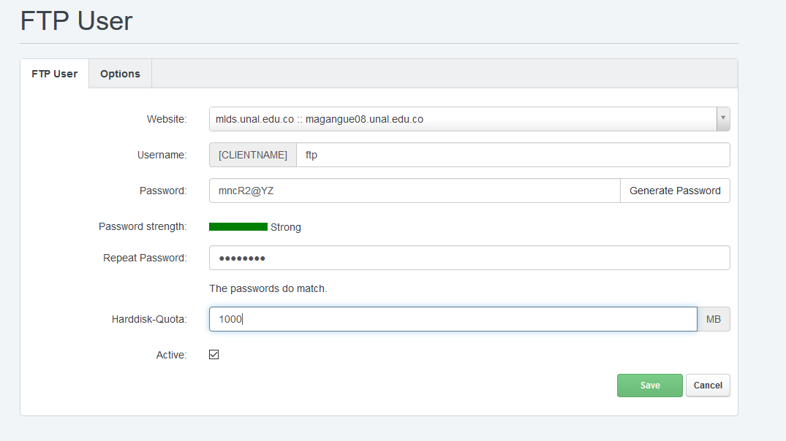
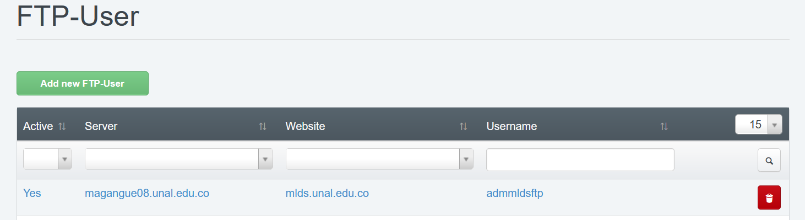

# Crear usuario de FTP en ispconfig

una vez creamos el sitio en [02_crear_sitio_en_ispconfig](02_crear_sitio_en_ispconfig.md) ahora en la pesaña de sitios, nos dirigimos al menu izquierdo y buscamos *FTP-Accounts*.

Damos clic en *Add new FTP-User*, y se desprendera un formulario

## FTP User

Aqui vamos en el apartado de *Username* ponemos ftp, damos clic en generar contraseña y copiaremos ese numero para entregarle al usuario la contraseña, en el espacio en disco para ftp tambien seleccionamos 1000MB, y damos a guardar

Una vez guardado, veremos que aparece la cuenta de ftp con el numbre de usuario completo, el cual copiaremos para entregar al usuario

ya tenemos configurado el sitio