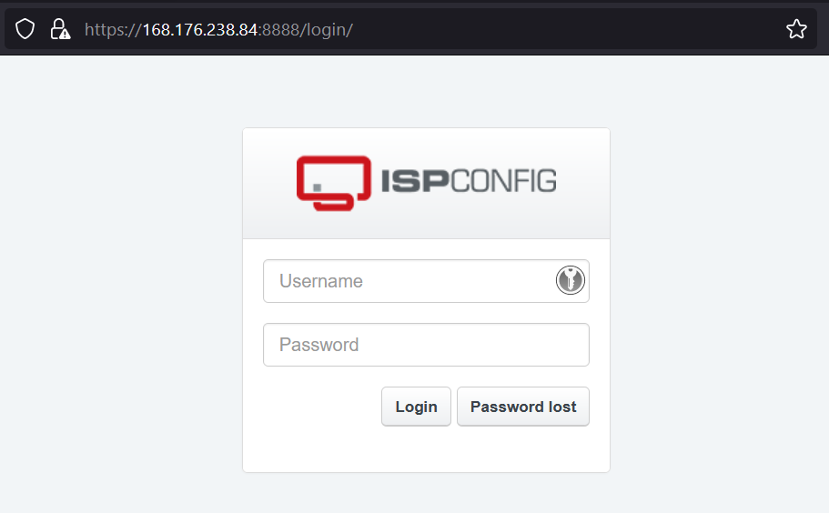
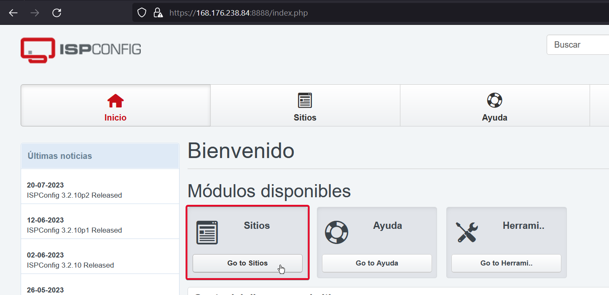
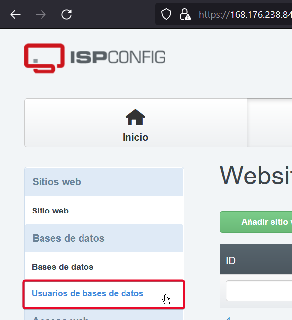
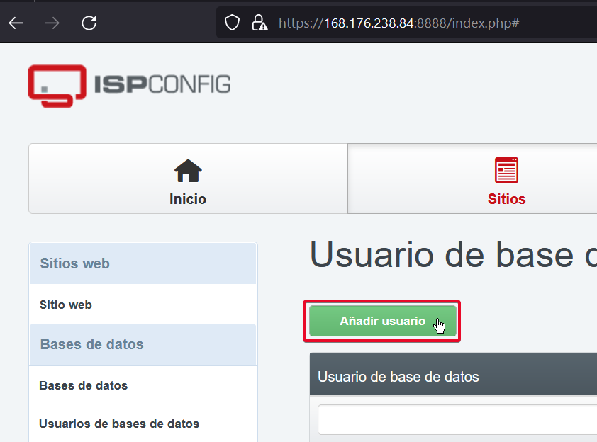
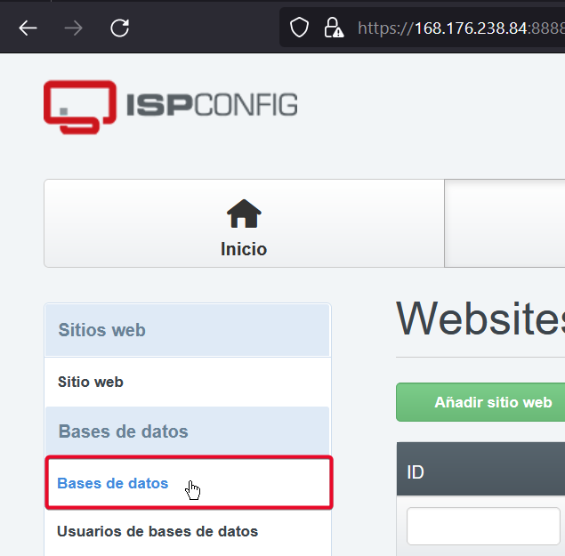
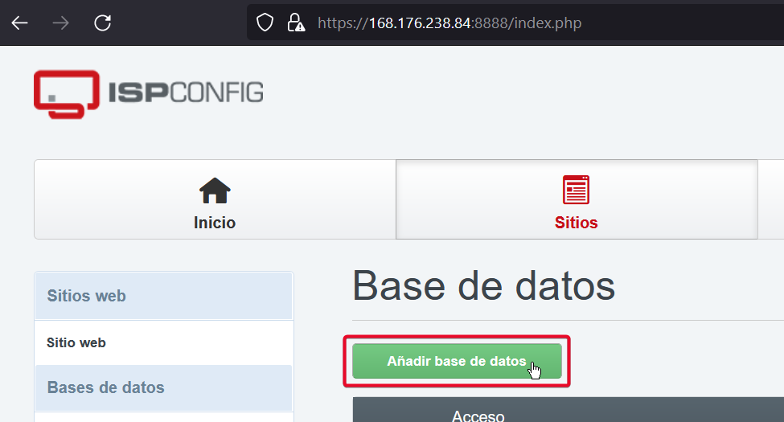

# Crear base de datos
Para crear una base de datos en el sitio debemos ingresar a la plataforma de administración del sitio, para esto por medio del navegador ingresamos la IP de nuestro servidor, por ejemplo ingresaremos a: https://168.176.84:8888 y veremos el inicio de sesión

>[!note] Nota:
Es de recordar que los datos como dirección del servidor, usuario, administrador, puertos y la información necesaria fue entregada al momento de resolver el caso de creación de hosting, en la mesa de ayuda

Una vez ingresamos como administrador, nos dirigimos en el panel a *Go to Sites*

## Crear usuario de base de datos
Una vez ingresemos a sitios en el panel izquierdo nos dirigimos al apartado de *Usuario de bases de datos*.

Damos clic en el botón *Añadir usuarios*

Se nos desplegará un formulario simple donde lo único que tenemos que agregar es el usuario y generar una contraseña, antes de presionar en el botón guardar se debe copiar el usuario y la contraseña generada.

>[!warning] Advertencia:
> Tenga en cuenta guardar este usuario y contraseña generada en su administrador de contraseñas preferido, estas son las credenciales que se usaran para el acceso a la base de datos.

## Crear base de datos
Una vez tenemos un usuario podemos dirigirnos en el panel izquierdo, nos dirigimos al apartado de *Bases de datos*

Ahora presionamos sobre *Añadir base de datos*

En el formulario que aparece seleccionaremos el sitio al que aplicara, el usuario que creamos en el paso anterior que tendrá acceso, así como ingresar los demás datos que requerimos en nuestra base de datos, una vez realizado esto daremos en el botón de guardar. 

>[!info] Información:
> Es de recordar que para ingresar como administrador o ingresar por FTP se debe realizar desde la red interna de la Universidad.