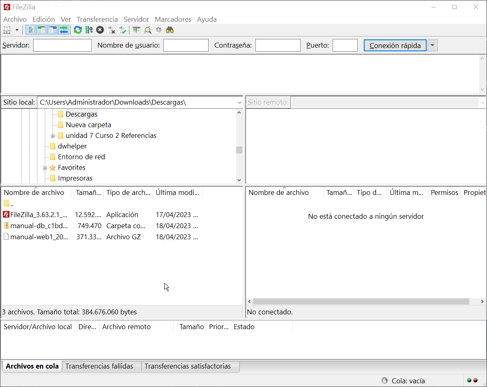

# Subir archivos por FTP

Una vez instalado FileZilla, abrimos el programa y veremos la siguiente ventana:

En la parte superior se encuentran los campos de conexión

Es en estos campos donde ingresaremos los datos de conexión recibidos al momento de la creación del hosting.

Una vez demos a conectar veremos como aparecen unas carpetas al lado derecho de la pantalla, estas carpetas son las de nuestro servidor, ahora podemos navegar en las carpetas de nuestro equipo local y enviarlos al servidor o viceversa.

**Nota**: la carpeta web del servidor es donde deben ir los archivos del sitio.